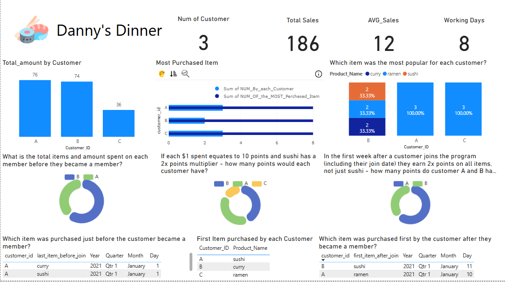

# Danny-s-Dinner
"Data analysis project based on Danny's Dinner case study. SQL queries were used to extract and transform insights from the database, followed by interactive visualizations in Power BI to explore customer behavior, product performance, and sales trends."
# 🍽️ Danny's Dinner – SQL & Power BI Case Study

تحليل بيانات عملي مبني على دراسة حالة Danny's Dinner، باستخدام استعلامات SQL لاستخراج وتحويل البيانات، ثم بناء داشبورد تفاعلي في Power BI لاستكشاف سلوك العملاء، أداء المنتجات، واتجاهات المبيعات.

## 🛠️ الأدوات المستخدمة
- SQL Server Management Studio (SSMS)
- Power BI Desktop
- DAX
- Power Query

## 📂 محتويات المشروع
- `Danny's Dinner.bak`: نسخة احتياطية من قاعدة البيانات الأصلية
- `SQL Final Queries.sql`: مجموعة الاستعلامات المستخدمة لاستخراج وتحليل البيانات
- `Report.pbix`: ملف Power BI يحتوي على الرسوم البيانية والتحليلات
- `Requirements.pdf`: تفاصيل المتطلبات الأساسية للمشروع
- `Capture.PNG`: معاينة للداشبورد النهائي

## 🎯 أهداف المشروع
- تحليل سلوك العملاء بناءً على الطلبات
- تحديد المنتجات الأكثر شعبية والأكثر ربحًا
- تحليل المبيعات حسب الوقت ونوع المنتج
- بناء داشبورد تفاعلي يسهل فهم النتائج واتخاذ القرار

## 📷 معاينة الداشبورد

## 👨‍💻 المؤلف
**Mo (Muhammad Emad Ahmed)**  
Data Analyst | SQL • Power BI • DAX  
مشروع تدريبي ضمن دراسة حالة من [8week SQL challenge](https://8weeksqlchallenge.com/case-study-1/)

---

